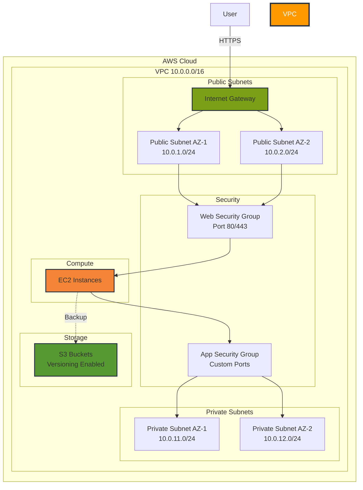

# Terraform AWS Infrastructure Provisioner

> **Production-ready Infrastructure as Code (IaC) solution for automated AWS resource provisioning with reusable Terraform modules**

[](https://github.com/atindersingh/terraform-aws-iac-provisioner)
[](https://www.terraform.io/)
[](https://registry.terraform.io/providers/hashicorp/aws/latest)
[](LICENSE)

---

## 📖 What is Terraform AWS IaC Provisioner?

A comprehensive Infrastructure as Code solution that automates AWS cloud resource provisioning using Terraform. This project demonstrates enterprise-grade infrastructure management through modular, reusable components that can provision complete environments in minutes rather than hours of manual configuration.

The infrastructure includes VPC networking with public/private subnets, security groups, compute resources, and storage services - all configured following AWS best practices for security, scalability, and high availability.

**Key Features:**
- 🏗️ **Modular Architecture** - Reusable Terraform modules for networking, compute, and storage
- 🚀 **Rapid Provisioning** - Deploy complete environments in under 5 minutes
- 🔒 **Security First** - Implements AWS security best practices with proper network segmentation
- 📦 **Multi-Environment** - Separate configurations for dev, staging, and production
- 🐳 **Container Ready** - Dockerized deployment targets for application workloads
- ♻️ **DRY Principles** - Single source of truth with variable-driven configurations

---

## 🏛️ Architecture



---

## 🛠️ Tech Stack

**Infrastructure:** Terraform 1.5+, AWS Provider 5.0+  
**Cloud Services:** VPC, EC2, S3, IAM, Security Groups  
**Container Runtime:** Docker  
**State Management:** S3 Backend with DynamoDB locking  

---

## 📁 Project Structure

```
terraform-aws-iac-provisioner/
├── terraform/
│   ├── backend.tf                    # S3 backend configuration
│   ├── modules/
│   │   ├── networking/               # VPC, subnets, routing
│   │   │   ├── main.tf
│   │   │   ├── variables.tf
│   │   │   └── outputs.tf
│   │   ├── compute/                  # EC2, security groups
│   │   │   ├── main.tf
│   │   │   ├── variables.tf
│   │   │   └── outputs.tf
│   │   └── storage/                  # S3 buckets
│   │       ├── main.tf
│   │       ├── variables.tf
│   │       └── outputs.tf
│   └── environments/
│       └── dev/                      # Development environment
│           ├── main.tf
│           ├── variables.tf
│           └── terraform.tfvars.example
├── docker/
│   └── Dockerfile                    # Application container
├── docs/                             # Learning documentation
└── README.md
```

---

## 🚀 Quick Start

### Prerequisites
- [Terraform](https://www.terraform.io/downloads.html) v1.5 or higher
- [AWS CLI](https://aws.amazon.com/cli/) configured with valid credentials
- [Docker](https://docs.docker.com/get-docker/) (optional, for containerized deployments)
- AWS Account with appropriate IAM permissions

### Basic Usage

```bash
# Clone the repository
git clone https://github.com/yourusername/terraform-aws-iac-provisioner.git
cd terraform-aws-iac-provisioner

# Navigate to environment
cd terraform/environments/dev

# Copy and configure variables
cp terraform.tfvars.example terraform.tfvars
# Edit terraform.tfvars with your AWS region and preferences

# Initialize Terraform
terraform init

# Review the execution plan
terraform plan

# Provision infrastructure
terraform apply

# Destroy infrastructure when done
terraform destroy
```

**Need detailed setup instructions?** → See [SETUP.md](SETUP.md)

---

## 📚 Documentation

| Document | Description |
|----------|-------------|
| [SETUP.md](SETUP.md) | Comprehensive setup guide with AWS configuration |
| [LEARNING_ROADMAP.md](LEARNING_ROADMAP.md) | Step-by-step learning path from basics to advanced |
| [LICENSE](LICENSE) | MIT License |

---

## 🧪 Validation

```bash
# Validate Terraform configuration
terraform validate

# Check formatting
terraform fmt -check -recursive

# Security scan (requires tfsec)
tfsec .
```

---

## 🎯 Why This Project?

This project demonstrates:

- **Infrastructure as Code** expertise with Terraform
- **AWS Cloud Architecture** knowledge (VPC, multi-AZ deployment, security best practices)
- **DevOps Automation** skills (eliminating manual infrastructure setup)
- **Modular Design** patterns for reusable, maintainable infrastructure
- **Production-Ready** practices (state management, variable abstraction, environment separation)

**Real-World Impact:** Reduced environment provisioning time from 2+ hours of manual work to under 5 minutes of automated deployment.

---

## 📄 License

MIT © 2026 Atinder Singh

---

## 👤 Author

**Atinder Singh**  
GitHub: [@atindersingh](https://github.com/atindersingh)

---

**⭐ If you find this useful, please star it!**
- Document any challenges and solutions in the `docs/04-integration-journey.md` file.

## Contribution
Feel free to contribute by adding more modules, improving documentation, or sharing your learning experiences. 

## License
This project is licensed under the MIT License - see the LICENSE file for details.